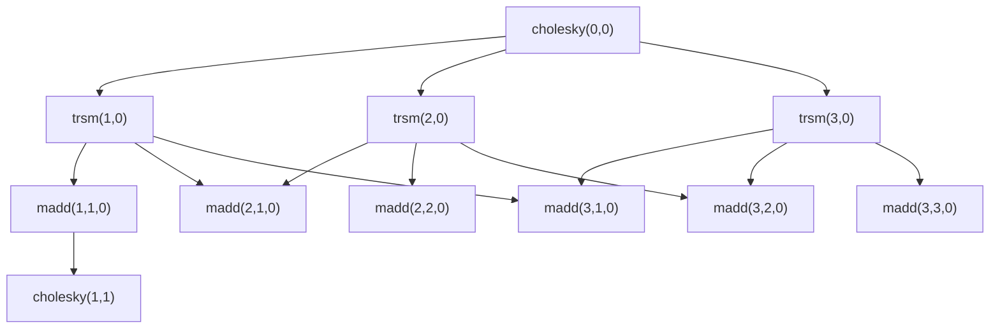
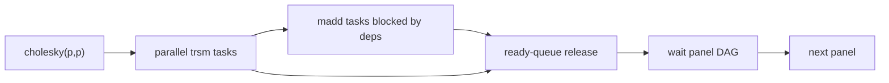
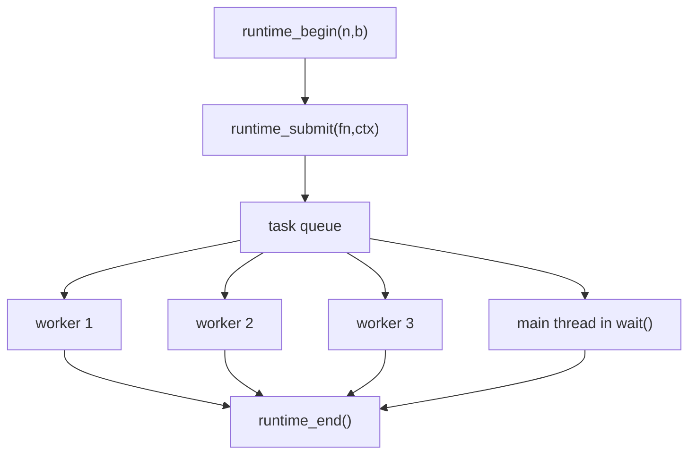
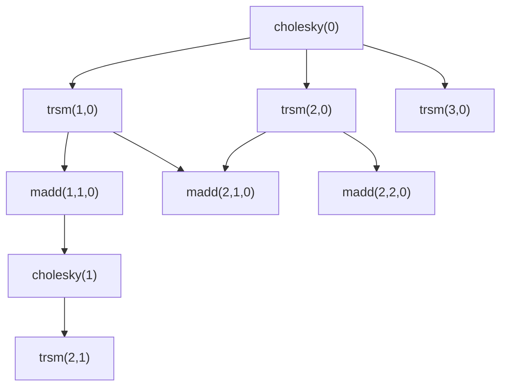

# 并行优化与算子图调度原理

本文面向具备基础编程知识、但不一定熟悉编译器和并行数值计算的读者，解释本项目为什么可以并行、LLVM Pass 做了什么、运行时如何调度任务，以及后续应如何继续优化。

## 1. 问题背景

本项目优化的是分块 Cholesky 分解。Cholesky 分解用于把一个对称正定矩阵 `A` 分解成：

```text
A = L * L^T
```

其中 `L` 是下三角矩阵。直接对整个大矩阵做分解很难并行，因此 baseline 把矩阵切成很多小块，每一轮处理一个对角块和它右下方的剩余区域。

可以把矩阵看成一个块矩阵：

```text
          block column
        0      1      2      3
     +------+------+------+------+
  0  | B00  | B01  | B02  | B03  |
     +------+------+------+------+
  1  | B10  | B11  | B12  | B13  |
     +------+------+------+------+
  2  | B20  | B21  | B22  | B23  |
     +------+------+------+------+
  3  | B30  | B31  | B32  | B33  |
     +------+------+------+------+
        block row
```

实际只需要计算下三角区域：

```text
     +------+------+------+------+
  0  | B00  |      |      |      |
     +------+------+------+------+
  1  | B10  | B11  |      |      |
     +------+------+------+------+
  2  | B20  | B21  | B22  |      |
     +------+------+------+------+
  3  | B30  | B31  | B32  | B33  |
     +------+------+------+------+
```

每一轮 panel 处理包含三类算子：

- `cholesky`：分解当前对角块。
- `trsm`：用当前对角块更新当前列下面的块。
- `madd`：用已经更新好的当前列块，更新右下方剩余矩阵。

baseline 的循环结构可以简化成：

```cpp
for (int i = 0; i < n; i += b) {
    cholesky(diagonal_block(i));

    for (int j = i + b; j < n; j += b) {
        trsm(block(j, i), diagonal_block(i));
    }

    for (int j = i + b; j < n; j += b) {
        for (int k = j; k < n; k += b) {
            madd(block(k, i), block(j, i), block(k, j));
        }
    }
}
```

## 2. 为什么可以并行

并行优化的核心不是“把所有函数都丢给线程池”，而是找出哪些计算互相独立。

以第 `p` 个 panel 为例：

```text
第 p 轮：

1. cholesky(p,p)
2. trsm(p+1,p), trsm(p+2,p), trsm(p+3,p), ...
3. madd(p+1,p+1,p), madd(p+2,p+1,p), madd(p+2,p+2,p), ...
```

依赖关系是：

```text
cholesky(p,p)
    |
    +--> trsm(p+1,p)
    +--> trsm(p+2,p)
    +--> trsm(p+3,p)
    |
    +--> ...

madd(r,c,p) 依赖 trsm(r,p) 和 trsm(c,p)
```

因此：

- 同一个 panel 内，所有 `trsm(row, panel)` 互相独立，可以并行。
- 当相关 `trsm` 完成后，很多 `madd(row, col, panel)` 也互相独立，可以并行。
- 下一轮 `cholesky(panel + 1, panel + 1)` 必须等对应块被前一轮 `madd` 更新完成。

这个关系可以画成任务图：



图里的节点是任务，箭头是依赖。没有直接或间接依赖的节点可以同时运行。

## 3. 当前实现采用的保守调度

当前 Pass 已经恢复一版基于一维 `GEPOperator` offset 的 block key，并用 runtime ready queue 表达 panel 内 `trsm -> madd` 依赖。跨 panel 依赖仍然保守，进入下一 panel 前保留 barrier。

对每个 panel：

```text
cholesky 同步执行
        |
        v
提交本 panel 所有 trsm 任务
        |
        v
提交本 panel 所有 madd 任务
        |
        v
runtime DAG：每个 madd 等对应 trsm 完成后进入 ready queue
        |
        v
wait：等待 panel-local DAG 全部完成
        |
        v
进入下一个 panel
```

对应图示：



这种方法的优点：

- 依赖关系简单，正确性容易保证。
- 不需要修改官方算子实现。
- 不需要重写算法源码。
- 能从 IR 层识别算子调用并插入运行时接口。

缺点：

- `madd` 中只有一小部分结果会影响下一轮 `cholesky`，但当前实现仍等待所有 `madd` 完成后才进入下一轮。
- 在 48/64 核平台上，panel barrier 可能导致很多核心等待关键路径。
- 单个 panel 后期任务变少时，负载均衡会变差。

## 4. LLVM Pass 做了什么

本项目遵守“从编译层优化”的思路。Pass 不清空 `block_cholesky`，不把整个函数替换成手写 runtime 算法，而是在 LLVM IR 中分析和改写算子调用。

### 4.1 IR 版本化

Pass 保留原始 `block_cholesky` 作为小块串行路径，同时克隆出一个异步版本：

```text
原始函数：block_cholesky(...)
异步克隆：compiler2026_async_impl(...)
```

入口处插入分支：

```text
if (compiler2026_runtime_should_async(n, b))
    return compiler2026_async_impl(A, L, n, b);
else
    run original serial IR path;
```

这么做是因为任务调度有额外开销。默认 runtime predicate 使用 `b >= 32`、block 数大于 1 且可用线程数大于 1；`COMPILER2026_ASYNC_MIN_B` 和 `COMPILER2026_DAG_THREADS` 可以用于实验覆盖。

### 4.2 算子调用 outline

原始 IR 中有类似调用：

```llvm
call void @trsm(...)
call void @madd(...)
```

Pass 为它们生成 task function：

```llvm
define internal void @compiler2026_task_trsm(ptr %ctx) {
  ; 从 ctx 里取出参数
  call void @trsm(...)
  ret void
}

define internal void @compiler2026_task_madd(ptr %ctx) {
  ; 从 ctx 里取出参数
  call void @madd(...)
  ret void
}
```

注意：官方 `trsm` / `madd` ABI 调用仍然在 Pass 生成的 IR 任务函数中。runtime 只负责调度任务，不封装、不替换、不重写官方算子。

### 4.3 call site 替换为任务提交

异步版本中的原始调用点会被改写成：

```llvm
%ctx = call ptr @compiler2026_runtime_alloc(...)
store 参数到 %ctx
call void @compiler2026_runtime_submit_deps(ptr @compiler2026_task_trsm, ptr %ctx, ...)
```

含义是：

1. 为当前算子调用保存参数。
2. 把 task function 指针、参数指针和恢复出的 block key 交给 runtime。
3. runtime 根据 latest producer 关系决定 task 立即进入 ready queue，还是等待前驱 task 完成后释放。

### 4.4 wait 插入

Pass 使用 `LoopInfo` 找到 `madd` 所在 panel 循环的出口，在合适的位置插入：

```llvm
call void @compiler2026_runtime_wait()
```

这样可以保证：

- 进入下一 panel 前，所有 `madd` 任务都完成。
- 如果某个 `trsm` 的 block key 恢复失败，Pass 会退回普通 submit 并在对应 loop exit 插入保守 wait。

## 5. Runtime 如何调度任务

runtime 提供非常小的接口：

```c
void compiler2026_runtime_begin(int n, int b);
void compiler2026_runtime_register_task(void (*fn)(void *), const char *name);
void *compiler2026_runtime_alloc(size_t size);
void compiler2026_runtime_submit(void (*fn)(void *), void *ctx);
void compiler2026_runtime_submit_deps(
    void (*fn)(void *), void *ctx, int dep_a, int dep_b, int output);
void compiler2026_runtime_wait();
void compiler2026_runtime_end();
```

它的职责是通用任务调度，而不是理解 Cholesky 算法。调度路径只依赖函数指针和参数指针：

```text
这里有一个函数指针 fn
这里有一段参数 ctx
请找一个线程执行 fn(ctx)
```

`runtime_register_task` 只在打开 `COMPILER2026_DAG_PROFILE=1` 时给统计输出提供名字，例如 `trsm`、`madd`；它不改变任务执行方式，也不把官方算子封装进 runtime。

`runtime_submit_deps` 是第一版动态 DAG 接口。Pass 从 `L[row*n+col]` 这类 GEP offset 中算出 block key，把 `madd` 的两个输入 block key 和输出 block key 交给 runtime。runtime 只维护“哪个 key 最近由哪个 task 生产”和 successor 列表，不需要知道 Cholesky 的数学含义。

当前 runtime 做了几项优化：

- thread-local worker 池复用，避免每个矩阵反复创建线程。
- task context 使用 arena 分配，避免每个任务单独 `malloc/free`。
- `wait()` 时主线程也参与执行任务，减少主线程空等。
- 使用可复用 vector 队列，并根据首个 panel 的 `trsm + madd` 任务数预留 queue、DAG node 和 producer map 容量。
- queue/DAG reset 在 runtime mutex 下执行，避免 worker 池复用时清理调度状态和 worker 观察队列状态并发。
- 减少大量任务提交时的重复唤醒。
- 对小/中等 `b` 使用小批量提交和批量出队，降低细粒度 `madd` 任务的锁开销。
- 可选输出 task 数、队列等待、执行时间、worker idle、DAG 节点/边/释放等 profile 指标。
- 对 panel 内 `trsm -> madd` 依赖使用 ready queue，避免 `trsm` 阶段全局 wait。

benchmark 脚本会把这些 profile 行解析进 CSV。这样后续调 `b` 阈值、task batch 或 range task 时，可以同时看到速度、正确性和调度指标，而不是只凭一次运行的 stderr 日志判断。

简化执行流程：



## 6. 当前正确性为什么成立

当前实现虽然不是最激进的 DAG 调度，但它的同步边界足够保守。

对每个 panel：

```text
cholesky 完成
=> 提交所有 trsm
=> 提交所有 madd
=> runtime 根据 trsm producer 释放对应 madd
=> wait 等所有 panel-local DAG task 完成
=> 进入下一 panel
```

因此不会出现下面这些错误：

- `madd` 读取尚未完成的 `trsm` 输出。
- 下一轮 `cholesky` 读取尚未完成的 trailing matrix 更新。
- 多个任务同时写同一块数据。

更严格地说，当前策略已经把 panel 内 `trsm -> madd` 细化为 ready queue DAG，但跨 panel 仍压缩成全局同步。

```text
完整 DAG：更细，潜在并行度更高，分析更复杂
当前实现：panel 内 ready queue + panel 间 barrier，潜在并行度仍低于完整 DAG，但正确性边界清晰
```

## 7. 后续优化方向

### 7.1 从 panel barrier 升级到 ready-queue DAG

当前调度：

```text
cholesky(p) -> submit trsm/madd(p) with deps -> panel wait -> cholesky(p+1)
```

更理想的调度：

```text
cholesky(p+1) 只需要等待 block(p+1,p+1) 的更新完成
trsm(r,p+1) 只需要等待 block(r,p+1) 的更新完成
其他更远的 madd 可以继续在后台执行
```

这会缩短关键路径，让下一 panel 更早开始：



在这个图里，`C1` 不必等待所有 `M21/M22/...` 都完成，只需要等待 `M11` 这条关键依赖。这是大核数平台上的核心性能空间。

### 7.2 IR 层恢复 block 坐标

要生成真正 DAG，Pass 需要知道每个算子访问的是哪个块。

比如从 IR 中恢复：

```text
&L[j * n + i]  -> block(row=j/b, col=i/b)
&L[k * n + j]  -> block(row=k/b, col=j/b)
```

这要求分析：

- loop induction variable。
- GEP 地址表达式。
- `n` 和 `b` 的关系。
- 算子参数和矩阵块读写集合。

恢复出坐标后，Pass 才能生成：

```text
task madd(row, col, panel)
depends on trsm(row, panel), trsm(col, panel)
writes block(row, col)
```

### 7.3 任务粒度自适应

单个算子一个 task 不一定总是最佳：

- `b` 小时，任务太细，调度开销大。
- `b` 大时，任务足够重，细粒度有利于负载均衡。
- 核心数多时，需要更多任务填满队列。
- 核心数少时，过多任务只会增加开销。

当前 runtime 已先按 `b` 做了一层轻量批量调度；后续可以让 runtime 或 Pass 进一步根据 `n, b, block_count, thread_count` 选择：

```text
小 b：多个 madd 合并成一个 range task
中 b：单个算子一个 task
大 b：保持细粒度，必要时进一步切分大算子外层循环
```

### 7.4 大核数 runtime

当前 runtime 使用单全局队列，适合验证方向，但在 48/64 核上可能出现锁竞争。

后续应考虑：

- 每个 worker 一个本地队列。
- work stealing。
- NUMA-aware task placement。
- worker pinning。
- 把当前 profile 指标接入 benchmark CSV，并用于自动选择阈值和 task batch。

### 7.5 面向真实平台的实验方法

后续实验不应只看当前 4 vCPU VM。建议按以下维度系统测试：

- 线程数：`1, 2, 4, 8, 16, 32, 48, 64`。
- 矩阵规模：`512, 768, 1024, 2048, 4096, 8192, 10000`。
- block size：`8, 16, 24, 32, 48, 64, 96, 128, 192, 256`。
- 指标：正确率、几何平均加速比、P50/P95 时间、任务数、队列等待时间、worker 空闲率。

只有当一个优化在多组规模和多种线程数下都稳定提升，才应认为它是鲁棒优化。

## 8. 可以调研的方向

如果继续从编译器和并行运行时角度推进，建议调研：

- tiled Cholesky task DAG scheduling。
- PLASMA / QUARK。
- StarPU。
- PaRSEC。
- OpenMP task dependency `depend(in/out/inout)` 的编译 lowering。
- LLVM Polly / MLIR affine dependence analysis。
- LLVM Tapir / Cilk-style task parallel IR。
- Work stealing deque / Chase-Lev deque。
- NUMA-aware task scheduling on ARM server。

这些方向的共同点是：不靠手写替换算法取巧，而是恢复计算依赖、构建任务图、用合适的 runtime 执行。这也更符合本项目作为编译器竞赛作品的长期价值。
